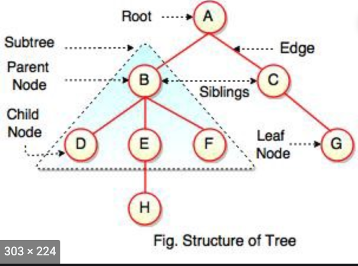

# Assessment 11: Data Structures and Algorithms

## Stacks

_**Stack** is a **Linear Data Structure** which follows a particular order in which the operations are performed. The order may be **LIFO**(Last In First Out) or **FILO**(First In Last Out). A real world stack allows operation at one end only. An example of Stack implementation is consider an example of plates stacked over one another in the canteen. The plate which is at the top is the first one to be removed, i.e. the plate which has been placed at the bottommost position remains in the stack for the longest period of time. So, it can be simply seen to follow **LIFO**(Last In First Out)/**FILO**(First In Last Out) order._ 

_The advanatges of **Stacks** are it provides a way for users to access different pieces of contiguous data in a Last In First Out manner. Stacks are easy to use and gurantee O(1) runtime for these 3 operations(E-Peek, E-Pop, E-Element)._ 

## Queues

_**Queues** is a **Linear Data Structure** which follows a particular order in which the operations are performed. The order is First In First Out **(FIFO)**. A good example of a queue is any queue of consumers for a resource where the consumer that came first is served first (Starbucks). The difference between stacks and queues is in removing. In a stack we remove the item the most recently added; in a queue, we remove the item the least recently added._

_The advantages are: it can basically have infinite length compared with the use of fixed-length arrays. It is fast and flexible . It can handle multiple data types. A queue allows for O(1) insertion from the end and O(1)deletion from the front._

## Deque

_A **Deque** also known as a double-ended queue, is an ordered collection of items similar to the queue. It has two ends, a front and a rear, and the items remain positioned in the collection. What makes a deque different is the unrestrictive nature of adding and removing items. New items can be added at either the front or the rear. Likewise, existing items can be removed from either end. In a sense, this hybrid linear structure provides all the capabilities of stacks and queues in a single data structure._ 

_The advantage of a **Deque**  are it can assume many of the characteristics of stacks and queues, it **does not** require the LIFO and FIFO orderings that are enforced by those data structures. It is up to you to make consistent use of the addition and removal operations._

## Linked Lists 

_A **Linked List** is a **linear data structure**, in which the elements are not stored at contiguous memory locations. In simple words, a linked list consists of nodes where each node contains a data field and a reference(link) to the next node in the list._

_The advantage of a **Linked List** are they can grow and shrink during run time. Insertion and Deletion Operations are Easier. Efficient Memory Utilization ,i.e no need to pre-allocate memory. Faster Access time,can be expanded in constant time without memory overhead. The runtime for a Linked List average is O(n) for (Acess and Search)_

## Hash Table 

_**Hashing** is a technique that is used to uniquely identify a specific object from a group of similar objects. In hashing, large keys are converted into small keys by using hash functions. The values are then stored in a data structure called **Hash Table**. The idea of hashing is to distribute entries (key/value pairs) uniformly across an array. Each element is assigned a key (converted key). By using that key you can access the element in O(1) time. Using the key, the algorithm (hash function) computes an index that suggests where an entry can be found or inserted. **Some examples of how hashing is used in our lives include**: In universities, each student is assigned a unique roll number that can be used to retrieve information about them. In libraries, each book is assigned a unique number that can be used to determine information about the book, such as its exact position in the library or the users it has been issued to etc._  

_An main advantage of a **Hash Table** over other table data structures is speed. This advantage is more apparent when the number of entries is large._ 

 

## Trees

_A **Tree** is a collection of nodes connected by directed (or undirected) edges. A tree is a **nonlinear** data structure, compared to arrays, linked lists, stacks and queues which are linear data structures. A tree can be empty with no nodes or a tree is a structure consisting of one node called the root and zero or one or more subtrees. **A tree has following general properties**: One node is distinguished as a root; Every node (exclude a root) is connected by a directed edge from exactly one other node; A direction is: parent -> children. One reason to use trees might be because you want to store information that naturally forms a hierarchy. For example, the file system on a computer. Runtime for tree data structures Θ(log(n)_

_A Tree data structure advantages they provide an efficient insertion and searching. Trees are very flexible data, allowing to move subtrees around with minumum effort._

 

## Linear Search

_A **Linear Search** sequentially checks each element of the list until it finds an element that matches the target value. If the algorithm reaches the end of the list, the search terminates unsuccessfully. **Linear Search** runs in at worst linear time and makes at most n comparisons, where n is the length of the list. If each element is equally likely to be searched, then linear search has an average case of n/2
comparisons, but the average case can be affected if the search probabilities for each element vary. **Linear Search** is rarely practical because other search algorithms and schemes, such as the binary search algorithm and hash tables, allow significantly faster searching for all but short lists._ 

_**Linear Search** advantages are the data does not have to be sorted, it does not require access capability. 

 

## Depth First and Breadth First Searches

_**Depth First Search** is dead simple. First, go to the specified start node. Now, arbitrarily pick one of that node’s neighbors and go there. If that node has neighbors, arbitrarily pick one of those and go there unless we’ve already seen that node. And we just repeat this process until one of two things happens. If reach the specified end node we terminate the algorithm and report success. If we reach a node with only neighbors we’ve already seen, or no neighbors at all, we go back one step and try one of the neighbors we didn’t try last time._

_This algorithm is called **Depth First Search** because we always prioritize searching the deepest node we know about. If there are ties, they are broken arbitrarily, but once we break our first tie (picking which neighbor of the start node to explore first) we will not try to search the other neighbors of the start_node until the first neighbor (and all of its neighbors) have been fully explored._

 

_The only difference between **Depth First Search** and **Breadeth First Search**  is the order in which nodes are processed. In **Depth First Search** you prioritized the deepest node in the frontier, in **Breadeth First Search**  you do the opposite. You explore all the neighbors of our starting node before exploring any other node. After you have explored all the immediate neighbors we explore nodes that are 2 hops away from the starting node. Then 3 hops, then 4 hops, and so on._

 
